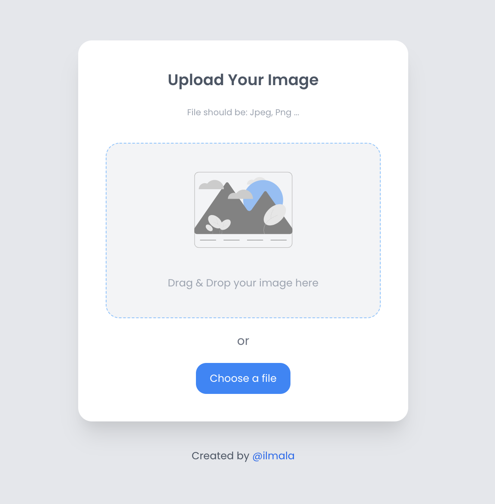

<h1 align="center">Image Uploader</h1>

<div align="center">
   Solution for a challenge from  <a href="http://devchallenges.io" target="_blank">Devchallenges.io</a>.
</div>

<div align="center">
  <h3>
    <a href="https://devchallenges-image-uploader.herokuapp.com">
      Demo
    </a>
    <span> | </span>
    <a href="https://{your-url-to-the-solution}">
      Solution
    </a>
    <span> | </span>
    <a href="https://devchallenges.io/challenges/O2iGT9yBd6xZBrOcVirx">
      Challenge
    </a>
  </h3>
</div>

<!-- TABLE OF CONTENTS -->

## Table of Contents

- [Overview](#overview)
    - [Built With](#built-with)
- [Features](#features)
- [How to use](#how-to-use)
- [Contact](#contact)
- [Acknowledgements](#acknowledgements)

<!-- OVERVIEW -->

## Overview



You can see the demo of my project [here](https://devchallenges-image-uploader.herokuapp.com/).

Even though the project was very simple, I learned how to:
- Use drop action with VueJs.
- Trigger select file from a button.
- Handle state in a single Vue Component.
- Handle Upload file with Laravel on Heroku.

Thanks to Laravel, the upload process took just over 5 lines of code ... impressive!

### Built With

<!-- This section should list any major frameworks that you built your project using. Here are a few examples.-->

- [Laravel 8](https://laravel.com//)
- [Vue.js](https://vuejs.org/)
- [Tailwind](https://tailwindcss.com/)

## Features

<!-- List the features of your application or follow the template. Don't share the figma file here :) -->

This application/site was created as a submission to a [DevChallenges](https://devchallenges.io/challenges) challenge. The [challenge](https://devchallenges.io/challenges/O2iGT9yBd6xZBrOcVirx) was to build an application to complete the given user stories.

- User can drag and drop an image to upload it
- User can choose to select an image from my folder
- User can see a loader when uploading
- When the image is uploaded, User can see the image and copy it
- User can choose to copy to clipboard

## How To Use

<!-- Example: -->

To clone and run this application, you'll need [Git](https://git-scm.com) and [Node.js](https://nodejs.org/en/download/) (which comes with [npm](http://npmjs.com)) 
for frontend. You'll need [PHP](https://www.php.net/) v7.3 or up and [Composer](https://getcomposer.org/) for backend API installed on your computer or VM. 
From your command line:

```bash
# Clone this repository
$ git clone https://github.com/ilmala/image-uploader

# Install and compile frontend dependencies
$ npm install && npm run dev

# Install backend dependencies
$ composer install
```
## Contact

- GitHub [@ilmala](https://github.com/ilmala)
- Twitter [@lucamalattia](https://twitter.com/lucamalattia)
